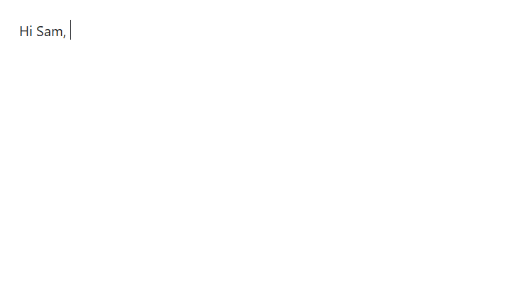
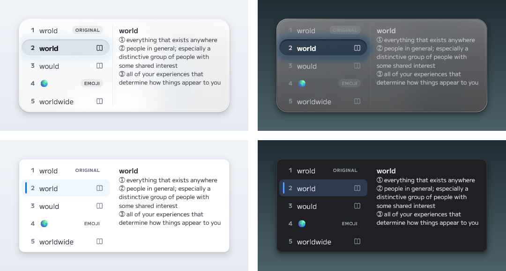
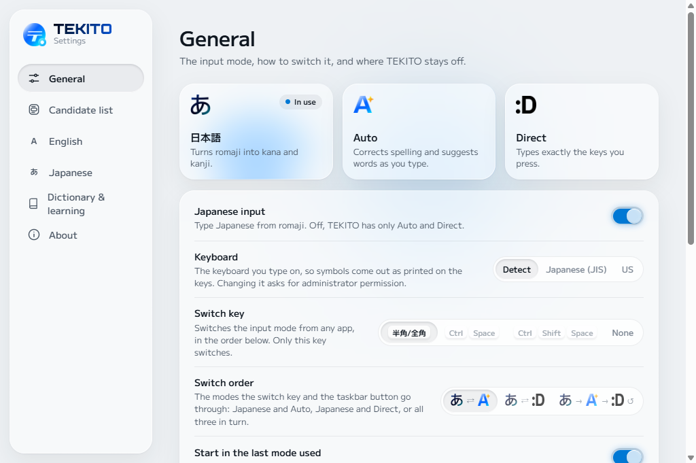

<p align="center">
  <picture>
    <source media="(prefers-color-scheme: dark)" srcset="docs/images/header-dark.png">
    
  </picture>
</p>

<p align="center">
  English and Japanese input for Windows.<br>
  English typos fixed on Space, romaji into Japanese that reads the whole sentence,<br>
  and nothing touched when you meant what you typed.
</p>

<p align="center">
  <a href="README_JP.md">日本語</a> ·
  <a href="#install">Install</a> ·
  <a href="#build">Build</a> ·
  <a href="https://capitata.dev">capitata.dev</a>
</p>

<p align="center">
  
</p>

TEKITO is an input method (a TSF text service), so it works in ordinary
Windows apps without plugins. One input method types both languages: English
gets its spelling fixed as you go, and with Japanese added, romaji becomes
kana and kanji. Everything runs on your PC.

> TEKITO is a preview. It has been tested in Notepad; other apps are listed in
> [the compatibility notes](docs/compatibility.md).

## Three modes

The button in the taskbar shows the mode. Click it to switch, or right-click
to pick one.

<table>
  <tr>
    <td align="center"></td>
    <td><b>Auto</b><br>Corrects English spelling and suggests words as you type.</td>
    <td></td>
  </tr>
  <tr>
    <td align="center">
      <picture>
        <source media="(prefers-color-scheme: dark)" srcset="docs/images/mode-direct-dark.png">
        
      </picture>
    </td>
    <td><b>Direct</b><br>Types exactly the keys you press.</td>
    <td></td>
  </tr>
  <tr>
    <td width="72" align="center">
      <picture>
        <source media="(prefers-color-scheme: dark)" srcset="docs/images/mode-japanese-dark.png">
        
      </picture>
    </td>
    <td><b>Japanese</b><br>Turns romaji into kana and kanji.</td>
    <td></td>
  </tr>
</table>

The switch key is Hankaku/Zenkaku on a Japanese keyboard and Alt+` on a US
one (or Ctrl+Space, Ctrl+Shift+Space, or none). With Japanese, it goes
between Japanese and Auto, Japanese and Direct, or round all three, as you
choose in Settings. On
a Japanese keyboard, Henkan switches to Japanese, Muhenkan to English, and
Hiragana to Japanese in hiragana (katakana with Shift). After a switch, the
new mode shows by the caret for a moment.

Japanese input is optional. Without it, or with it turned off in Settings,
TEKITO has Auto and Direct only. It stays off in terminals, in apps running
as administrator, and in any apps you list in Settings.

## Typing English

In Auto, type as usual. The word you are typing is underlined and a short
list of choices appears under it.

| Key | What it does |
| --- | --- |
| Space | Applies a confident correction and adds the space. Press again to step through the choices. |
| Shift+Space | Goes back to the previous choice. |
| Tab, ↑, ↓ | Moves through the list without committing. |
| Backspace | Right after a correction, puts back what you typed. |
| Esc | Keeps what you typed. |
| Enter | Picks the highlighted choice when you are in the list; otherwise ends the line as usual. |

Typing the next letter settles the word, so there is nothing to undo later.
TEKITO leaves alone words it recognizes, chat abbreviations like “brb”,
anything you capitalize yourself, anything that looks like code, URLs and
addresses, and fields marked as passwords, numbers or email.

A few things come up as choices too: “today” and “now” offer the date and
time, “(c)” and “->” offer © and →, and “1+2=” offers 3. What you typed
stays first, so nothing changes unless you pick one.



## Typing Japanese

With Japanese added, type romaji in Japanese mode; it becomes hiragana as you
type, underlined. Space converts the
whole line at once, split into phrases, and a second Space opens the list
for the phrase in focus.

<p align="center">
  
</p>

| Key | What it does |
| --- | --- |
| Space | Converts; then moves to the next candidate. Shift+Space goes back. |
| ← → | Before converting, moves the caret. After, moves between phrases. |
| Shift+← → | Makes the phrase in focus shorter or longer. |
| 1–9 | Picks a candidate from the list. |
| Tab, ↓ | Picks one of the predicted words shown while you type. |
| Enter | Commits what is shown. |
| Esc | After converting, goes back to the kana; before, clears what you typed. |
| PageUp, PageDown | Pages through the open list. |
| F6–F8 | Hiragana, katakana, half-width katakana. |
| F9, F10 | The letters you typed, full-width or as typed. |
| Shift+letter | Starts an English word inside Japanese. In the middle of Japanese, the letters that follow stay as typed (NHKの, Windows11). |
| Henkan | With nothing typed, converts the selected text again (or what you just entered). |
| Ctrl+Backspace | Right after entering text, takes it back to the conversion. |
| Ctrl+Delete | Stops suggesting a word TEKITO learned (the prediction or candidate picked). |

- **The whole sentence counts.** Conversion weighs which words go together,
  learned from Japanese news and Wikipedia text, and carries on from what you
  committed just before, so a phrase converted on its own still reads as
  part of the sentence.
- **A slip is not a dead end.** When the keys look like a slip of the finger
  (a neighboring key, a key dropped or doubled, two swapped), what you meant
  is offered in the list, marked TYPO. What you typed stays first; you
  never have to delete and retype.
- **Meanings beside the list.** Candidates with a meaning carry a small book
  sign, and the highlighted one's meaning appears beside the list, so you
  can tell 初め from 始め. Slang such as エモい and 推し活 has one too.
- **Katakana with its English.** Loanwords offer the English word too
  (ミーティング → meeting).
- **It learns your way of writing.** The conversion you pick for a reading
  comes first the next time.
- **Your own words.** Add a reading and how you write it in Settings, and
  choose whether it comes first, is only offered, or never comes up.
- **Numbers, dates and symbols.** Digits read as numbers, so 3こ is 3個 and
  100えん 100円, and converting a number offers the other width and kanji
  (千二百三十四). きょう and いま offer the date and time, やじるし and ほし
  symbols, にこにこ emoticons, and 1+2= its answer. Single kanji come after
  a reading's words.
- **Postal codes.** Add Japan Post's postal code data under
  **Settings → Dictionary & learning**, and 1000001 converts to its address.
- **Live conversion.** Turn it on in **Settings → Japanese** to see the
  text converted as you type; Space then picks another candidate for the
  last phrase.
- **Emoji.** Readings offer emoji after the symbols: ねこ gives 🐱.
- **Words from your old IME.** Words exported as text from Microsoft IME,
  Google Japanese Input or ATOK can be imported under
  **Settings → Dictionary & learning**.
- **Everywhere you type.** TEKITO works in the Start menu's search,
  Settings and Store apps too, and a katakana field (furigana) types
  katakana.

## Settings



Settings shows what most people change; **Show advanced settings** at the
end of General adds the rest, such as the widths of what you type in
Japanese and a page to turn each special conversion on or off.

Settings, the setup program and TEKITO's own messages are available in
English and Japanese; they follow the Windows display language unless you
pick one under **Settings → General → Language**.

## Privacy

Everything TEKITO does happens on your computer. It does not send your
typing anywhere, it has no account and no telemetry, and it does not use the
network while you type. What it learns from your choices stays in
`%LOCALAPPDATA%\TEKITO` and can be cleared from Settings. The only download
is the Japanese data, fetched by the setup program when you choose Japanese.
Postal codes come from a file you download from Japan Post yourself and add
in Settings.
See [the privacy notice](PRIVACY.md).

## Install

Download `TEKITO-0.4.0-full-installer.exe` from
[Releases](https://github.com/Canta360/tekito/releases/latest) and run it.

- **Add Japanese input** (on when Windows shows Japanese) downloads the
  Japanese dictionary and language data, about 48 MB, from the same release,
  and checks it against the checksum the installer carries. TEKITO then
  appears in the Japanese keyboard list; its Auto and Direct cover English,
  so it leaves the English list unless you keep it there under **Options**.
- Without Japanese, TEKITO appears in the English keyboard list with Auto and
  Direct. Run the installer again to add Japanese later.
- It needs the Microsoft Edge WebView2 Runtime, which Windows 11 already has.

After installing, restart the apps you want to type in (or sign out and back
in), then pick TEKITO with Win+Space.

The installer is not code-signed yet, so Windows SmartScreen may ask you to
confirm before it runs. To install without a network, see
[the installer notes](installer/README.md).

## Build

You need Windows 11, Visual Studio 2026 (or 2022) with the C++
desktop workload, CMake 3.24 or later, Python 3, and Node.js for the Settings
page.

```powershell
cd apps\tekito-settings\ui
npm ci
npm run build
cd ..\..\..
cmake --preset windows-x64-debug
cmake --build --preset windows-x64-debug
.\scripts\verify.ps1
```

`verify.ps1` builds everything, runs the tests and checks the rules in
[Working on TEKITO](#working-on-tekito). To try your build, register it from
an administrator PowerShell with `scripts\register-debug.ps1`
and remove it again with `unregister-debug.ps1`.

The language data lives in `data/`. The large packs are built from their
public sources rather than kept in the repository:

- `scripts\ja\prepare-japanese-packs.ps1` builds the Japanese dictionary from
  Mozc, the word statistics from the Leipzig corpora, and the meanings from
  TEKITO's slang list, Wiktionary and the Japanese WordNet. Without them Japanese types kana but
  does not convert.
- `scripts\en\prepare-full-data-packs.ps1` builds the English phrase
  statistics. TEKITO works without them.

See [Data Packs](docs/data-packs.md) for every pack, its source and its
license. To make an installer, build the `windows-x64-release` preset and run
`installer\package-release.ps1`; it also writes the Japanese data ZIP to
attach to the release.

## Repository layout

| Path | Contents |
| --- | --- |
| `src/Core` | English candidate search, ranking and the typing state machine. No Windows code. |
| `src/Core/Japanese` | Romaji, kana-kanji conversion, slips, predictions and meanings. No Windows code. |
| `src/Tsf` | The TSF text service and the candidate window. |
| `src/UserData` | Settings, the user dictionary and learning, stored in SQLite. |
| `tests` | Unit tests for the engines and user data (Japanese test data in `tests/data/ja`). |
| `eval`, `benchmarks` | Offline accuracy and speed measurements, in `en` and `ja`. |
| `apps/tekito-settings` | The Settings window: a Win32 host and a React page in WebView2. |
| `installer` | The setup program and packaging scripts. |
| `data` | Language data packs, each with its own manifest and NOTICE: `en` for English, `ja` for Japanese, `common` for both. |
| `scripts` | Build, install and check scripts; the ones that build each language's data are in `en` and `ja`. |

## Working on TEKITO

- Words and phrases belong in data packs, never in `if` statements.
- Nothing in the input path may use the network, and diagnostics never
  include what the user typed.
- TEKITO works through TSF only; no keyboard hooks or synthesized input.
- Leave correct words, names and code as they are. When unsure, suggest
  instead of replacing.

Bug reports and ideas are welcome in Issues. We are not taking pull requests
while TEKITO is in preview.

## License

The source code is available under the
[Functional Source License 1.1](LICENSE.md) (FSL-1.1-ALv2): use it, change
it and share it for anything except a competing commercial product. Each
release becomes Apache 2.0 two years after it is published. The installer we
publish is covered by [the TEKITO License Agreement](installer/TEKITO_LICENSE.md),
and each data pack keeps the license of its source: among them the Mozc
dictionary (IPAdic and BSD 3-Clause), the Leipzig Corpora Collection
(CC BY 4.0), Wiktionary (CC BY-SA 4.0) and the Japanese WordNet. The details
are in [Licensing](LICENSING.md) and
[third-party notices](THIRD_PARTY_NOTICES.md).

TEKITO is made by [Capitata](https://capitata.dev).

<p align="center">
  <a href="https://capitata.dev">
    <picture>
      <source media="(prefers-color-scheme: dark)" srcset="docs/images/capitata-dark.png">
      
    </picture>
  </a>
</p>
