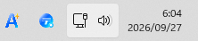
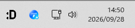
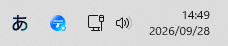
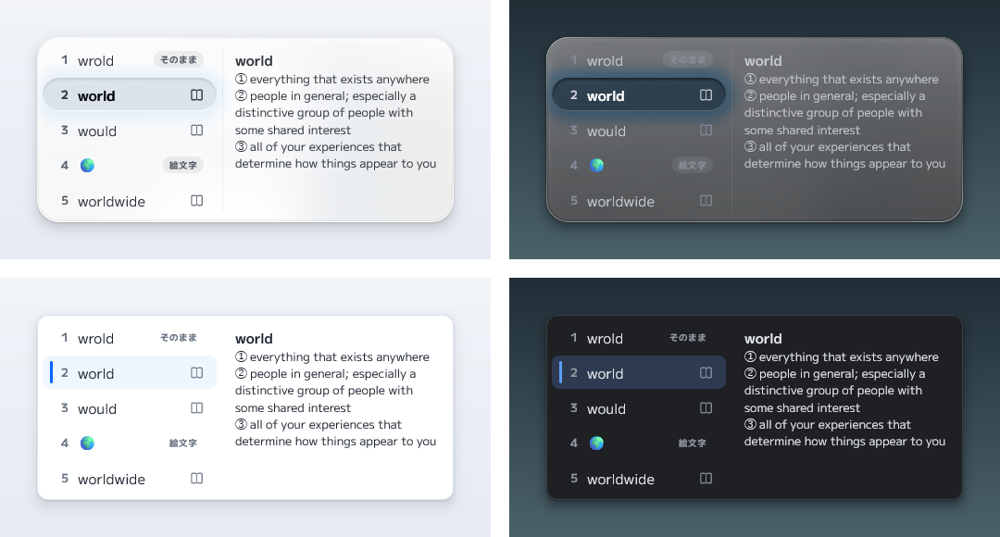
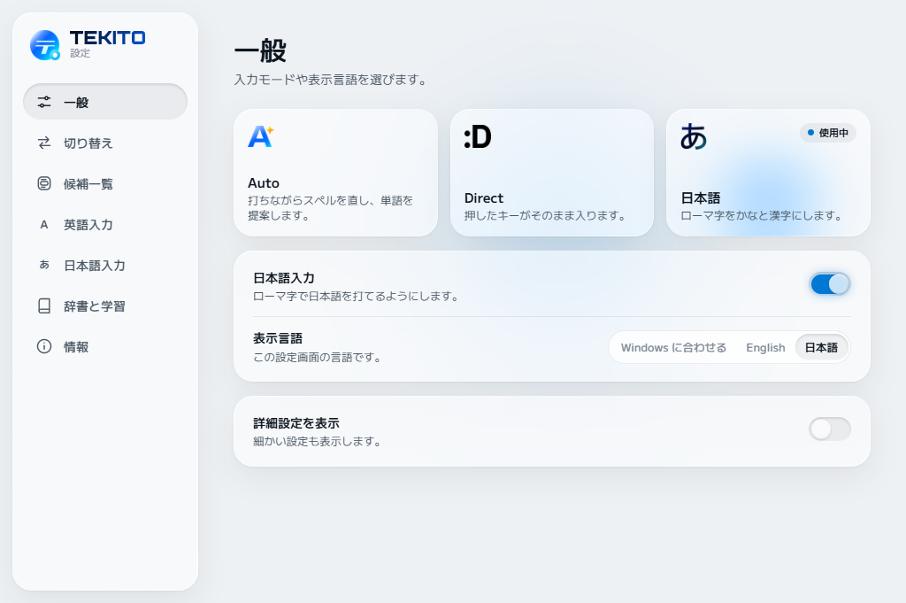

<p align="center">
  <picture>
    <source media="(prefers-color-scheme: dark)" srcset="docs/images/header-dark.png">
    
  </picture>
</p>

<p align="center">
  Windows で英語と日本語を打つための入力方式。<br>
  英語の打ち間違いは Space で直り、ローマ字は文全体を見て日本語になります。<br>
  打ったとおりでいいときは何もしません。
</p>

<p align="center">
  <a href="README.md">English</a> ·
  <a href="#インストール">インストール</a> ·
  <a href="#ビルド">ビルド</a> ·
  <a href="https://capitata.dev">capitata.dev</a>
</p>

<p align="center">
  
</p>

TEKITO は IME（TSF のテキストサービス）なので、普通の Windows アプリでそのまま使えます。ひとつの入力方式で英語と日本語の両方を打てます。英語は打ちながらスペルを直し、日本語を追加すればローマ字をかなと漢字にします。処理はすべて PC の中で完結します。

> TEKITO はプレビュー版です。動作を確認しているのはメモ帳のみです。ほかのアプリの状況は[互換性メモ](docs/compatibility.md)にあります。

## 3 つのモード

タスクバーのボタンが今のモードを表しています。クリックで切り替え、右クリックでモードを選べます。

<table>
  <tr>
    <td align="center"></td>
    <td><b>Auto</b><br>英語のスペルを直し、打ちながら単語を提案します。</td>
    <td></td>
  </tr>
  <tr>
    <td align="center">
      <picture>
        <source media="(prefers-color-scheme: dark)" srcset="docs/images/mode-direct-dark.png">
        
      </picture>
    </td>
    <td><b>Direct</b><br>押したキーがそのまま入ります。</td>
    <td></td>
  </tr>
  <tr>
    <td width="72" align="center">
      <picture>
        <source media="(prefers-color-scheme: dark)" srcset="docs/images/mode-japanese-dark.png">
        
      </picture>
    </td>
    <td><b>日本語</b><br>ローマ字をかなと漢字にします。</td>
    <td></td>
  </tr>
</table>

切り替えキーは、日本語キーボードなら半角/全角、US キーボードなら Alt+` です（Ctrl+Space、Ctrl+Shift+Space、なしも選べます）。日本語を追加すると、切り替えの順番を「日本語 ⇄ Auto」「日本語 ⇄ Direct」「日本語 → Auto → Direct」から設定で選べます。日本語キーボードでは、変換キーで日本語、無変換キーで英語、ひらがなキーでひらがなの日本語（Shift でカタカナ）になります。切り替えると、入力している場所に新しいモードが少しだけ表示されます。

日本語入力は追加するかどうかを選べます。入れていないとき、または設定でオフにしたときは、Auto と Direct だけになります。ターミナル、管理者として実行中のアプリ、設定で追加したアプリでは、TEKITO はオフになります。

## 英語を打つ

Auto で普段どおりに打ちます。入力中の単語に下線が付き、その下に候補が出ます。

| キー | 動作 |
| --- | --- |
| Space | 確信のある補正を適用してスペースを入れます。続けて押すと候補を順に送ります。 |
| Shift+Space | ひとつ前の候補に戻ります。 |
| Tab、↑、↓ | 確定せずに候補を移動します。 |
| Backspace | 補正の直後なら、打ったとおりに戻します。 |
| Esc | 打ったとおりにします。 |
| Enter | 候補を選んでいるときはその候補で確定します。それ以外は普通の改行です。 |

次の文字を打った時点で単語は確定するので、あとから取り消す操作はありません。知っている単語、「brb」のようなチャットの略語、自分で大文字にして打った語、コードらしい文字列、URL やアドレス、パスワード・数字・メール用の欄には手を出しません。

いくつかのものは候補にも出ます。「today」「now」で日付と時刻、「(c)」「->」で © と →、「1+2=」で 3 です。打ったとおりが先頭のままなので、選ばなければ何も変わりません。



## 日本語を打つ

日本語を追加すると、日本語モードでローマ字を打てます。打つと、下線付きのひらがなになります。Space で行全体を一度に変換して文節に分け、もう一度 Space を押すと、選んでいる文節の候補一覧が開きます。

<p align="center">
  
</p>

| キー | 動作 |
| --- | --- |
| Space | 変換します。変換後は次の候補へ。Shift+Space で前の候補へ。 |
| ← → | 変換前はカーソルを移動。変換後は文節を移ります。 |
| Shift+← → | 選んでいる文節を縮める・伸ばす。 |
| 1〜9 | 候補一覧から選びます。 |
| Tab、↓ | 打っている間に出る予測候補から選びます。 |
| Enter | 表示どおりに確定します。 |
| Esc | 変換後はかなに戻し、変換前は打った文字を消します。 |
| F6〜F8 | ひらがな、カタカナ、半角カタカナ。 |
| F9、F10 | 打った英字を全角で、またはそのまま。 |
| Shift+英字 | 日本語の途中で英単語を打ち始めます。 |

- **文全体で考えます。** 変換では、日本語のニュースやウィキペディアの文章から学んだ「一緒に使われやすい語」を重視し、直前に確定した内容からの続きとして読みます。文節ごとに変換しても、文の一部として読まれます。
- **打ち間違えても打ち直さなくていい。** 隣のキー、抜けたキーや余分なキー、入れ替わった 2 文字など、指の滑りらしい入力なら、打ちたかったはずの語を「もしかして」付きで候補に出します。打ったとおりの変換が先頭のままなので、消して打ち直す必要はありません。
- **候補の横に意味。** 意味のある候補には小さな本のマークが付き、選んでいる候補の意味が一覧の横に出ます。「初め」と「始め」の違いもその場でわかります。
- **カタカナには英語も。** 外来語には英単語も候補に出します（ミーティング → meeting）。
- **書き方を覚えます。** 読みに対して選んだ変換が、次から先に出ます。
- **自分の単語。** 設定で読みと書き方を登録できます。最初に出すか、候補に出すだけか、出さないかも選べます。
- **数字・日付・記号。** 数字を数として読むので、「3こ」は「3個」、「100えん」は「100円」になります。数字を変換すると、もう一方の幅や漢数字（千二百三十四）も出ます。「きょう」「いま」で日付と時刻、「やじるし」「ほし」で記号、「にこにこ」で顔文字、「1+2=」で答えが出ます。読みの単語のあとには単漢字も並びます。
- **郵便番号。** **設定 → 辞書と学習** で日本郵便の郵便番号データを入れると、「1000001」が住所に変換できます。

## 設定



設定画面には、よく使う項目だけを出しています。「一般」の最後にある **詳細設定を表示** をオンにすると、日本語で打つ文字の幅や、特別な変換を 1 つずつオン・オフするページなど、残りの項目も出ます。

設定画面、インストーラー、TEKITO のメッセージは日本語と英語に対応しています。通常は Windows の表示言語に合わせて表示され、**設定 → 一般 → 表示言語** で切り替えられます。

## プライバシー

TEKITO の処理はすべて PC の中で行います。入力した内容をどこにも送らず、アカウントもテレメトリもなく、入力中にネットワークを使いません。選んだ候補から学習した内容は `%LOCALAPPDATA%\TEKITO` に保存され、設定画面から消せます。ダウンロードするのは、インストール時に日本語を選んだときの日本語データだけです。郵便番号は、自分で日本郵便からダウンロードしたファイルを設定で入れます。詳しくは[プライバシーについて](PRIVACY.md)を参照してください。

## インストール

[Releases](https://github.com/Canta360/tekito/releases/latest) から `TEKITO-0.3.0-full-installer.exe` をダウンロードして実行します。

- **日本語入力を追加する**（Windows が日本語表示ならオン）を選ぶと、日本語の辞書と言語データ（約 45 MB）を同じリリースからダウンロードし、インストーラーが持っているチェックサムと照合します。TEKITO は日本語のキーボード一覧に入ります。英語は Auto と Direct で打てるので、英語の一覧からは外れます（**オプション**で残すこともできます）。
- 日本語を選ばない場合は、英語のキーボード一覧に Auto と Direct の TEKITO が入ります。あとからインストーラーを実行し直せば日本語を追加できます。
- Microsoft Edge WebView2 Runtime が必要ですが、Windows 11 には最初から入っています。

インストール後は使いたいアプリを再起動するか、サインアウトしてサインインし直してから、Win+Space で TEKITO を選んでください。

インストーラーはまだコード署名をしていないため、Windows SmartScreen が実行の確認を求めることがあります。ネットワークなしでインストールする方法は[インストール手順](installer/INSTALL_JP.md)にあります。

## ビルド

Windows 11、C++ デスクトップ開発ワークロード入りの Visual Studio 2026（または 2022）、CMake 3.24 以降、Python 3、設定画面用の Node.js が必要です。

```powershell
cd apps\tekito-settings\ui
npm ci
npm run build
cd ..\..\..
cmake --preset windows-x64-debug
cmake --build --preset windows-x64-debug
.\scripts\verify.ps1
```

`verify.ps1` はビルド、テスト、[開発のルール](#開発のルール)の確認をまとめて行います。自分のビルドを試すときは、管理者 PowerShell で `scripts\register-debug.ps1` を実行して登録し、`unregister-debug.ps1` で外します。

言語データは `data/` にあります。大きなパックはリポジトリに入れず、公開元から作ります。

- `scripts\ja\prepare-japanese-packs.ps1` は、Mozc から日本語辞書を、Leipzig のコーパスから語の統計を、Wiktionary と日本語 WordNet から意味のデータを作ります。これがないと、日本語はかなまでで漢字に変換できません。
- `scripts\en\prepare-full-data-packs.ps1` は英語のフレーズ統計を作ります。なくても TEKITO は動きます。

各パックの出典とライセンスは [Data Packs](docs/data-packs.md) にまとめてあります。インストーラーを作るときは `windows-x64-release` プリセットでビルドし、`installer\package-release.ps1` を実行します。リリースに添付する日本語データの ZIP も一緒に作られます。

## 構成

| パス | 内容 |
| --- | --- |
| `src/Core` | 英語の候補の検索・順位付けと入力の状態遷移。Windows に依存しません。 |
| `src/Core/Japanese` | ローマ字、かな漢字変換、打ち間違いの候補、予測、意味。Windows に依存しません。 |
| `src/Tsf` | TSF テキストサービスと候補ウィンドウ。 |
| `src/UserData` | 設定、ユーザー辞書、学習データ（SQLite）。 |
| `tests` | エンジンとユーザーデータのテスト（日本語のテスト用データは `tests/data/ja`）。 |
| `eval`、`benchmarks` | 精度と速さをオフラインで測る仕組み。`en` と `ja` に分かれています。 |
| `apps/tekito-settings` | 設定画面。Win32 のホストと WebView2 上の React。 |
| `installer` | セットアップと配布物を作るスクリプト。 |
| `data` | 言語データ。パックごとに manifest と NOTICE があります。英語は `en`、日本語は `ja`、両方で使うものは `common` にあります。 |
| `scripts` | ビルド、インストール、確認のスクリプト。言語ごとのデータを作るものは `en` と `ja` にあります。 |

## 開発のルール

- 単語やフレーズはデータに置き、`if` 文に書かない。
- 入力の処理経路でネットワークを使わない。診断情報に入力内容を含めない。
- TSF だけで動かす。キーボードフックや擬似入力は使わない。
- 正しい単語、名前、コードはそのままにする。迷ったら置き換えずに候補として出す。

不具合の報告やアイデアは Issues で受け付けています。プレビューの間はプルリクエストを受け付けていません。

## ライセンス

ソースコードは [Functional Source License 1.1](LICENSE.md)（FSL-1.1-ALv2）で公開しています。競合する商用製品に使うこと以外なら、使う・改変する・共有するのは自由です。各リリースは公開から 2 年後に Apache 2.0 になります。配布するインストーラーには [TEKITO 使用許諾契約](installer/TEKITO_LICENSE.md)が、言語データにはそれぞれの出典のライセンスが適用されます。日本語では Mozc の辞書（IPAdic と BSD 3-Clause）、Leipzig Corpora Collection（CC BY 4.0）、Wiktionary（CC BY-SA 4.0）、日本語 WordNet を使っています。詳しくは[ライセンスについて](LICENSING.md)と[サードパーティー通知](THIRD_PARTY_NOTICES.md)を参照してください。

TEKITO は [Capitata](https://capitata.dev) が開発しています。

<p align="center">
  <a href="https://capitata.dev">
    <picture>
      <source media="(prefers-color-scheme: dark)" srcset="docs/images/capitata-dark.png">
      
    </picture>
  </a>
</p>
